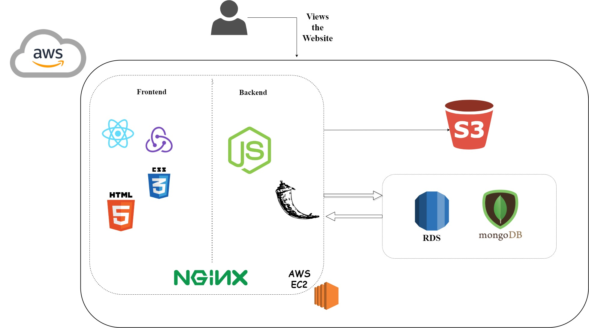
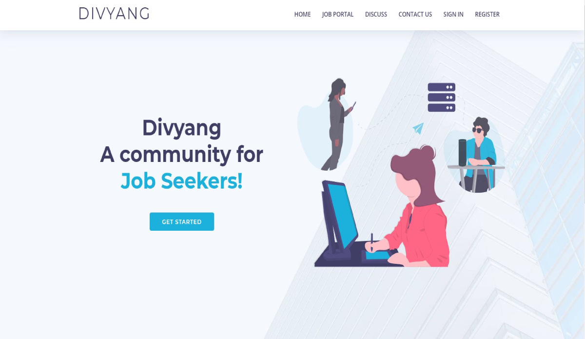
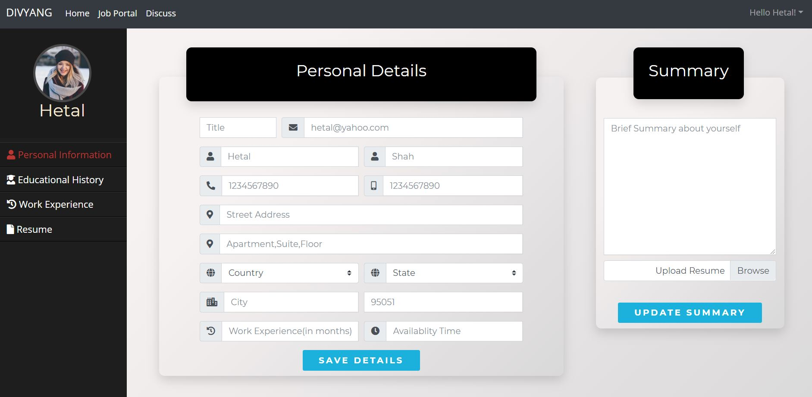
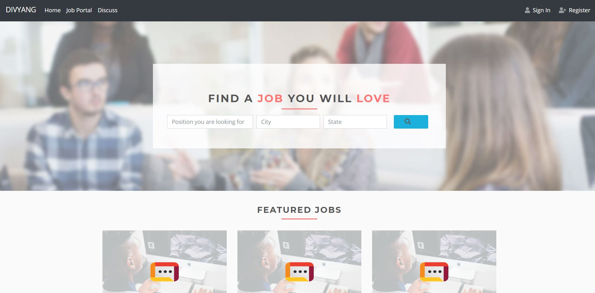
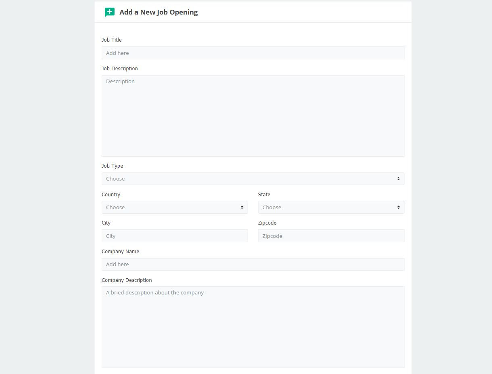
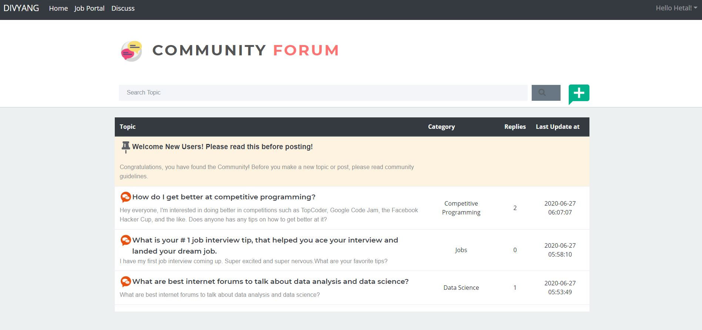
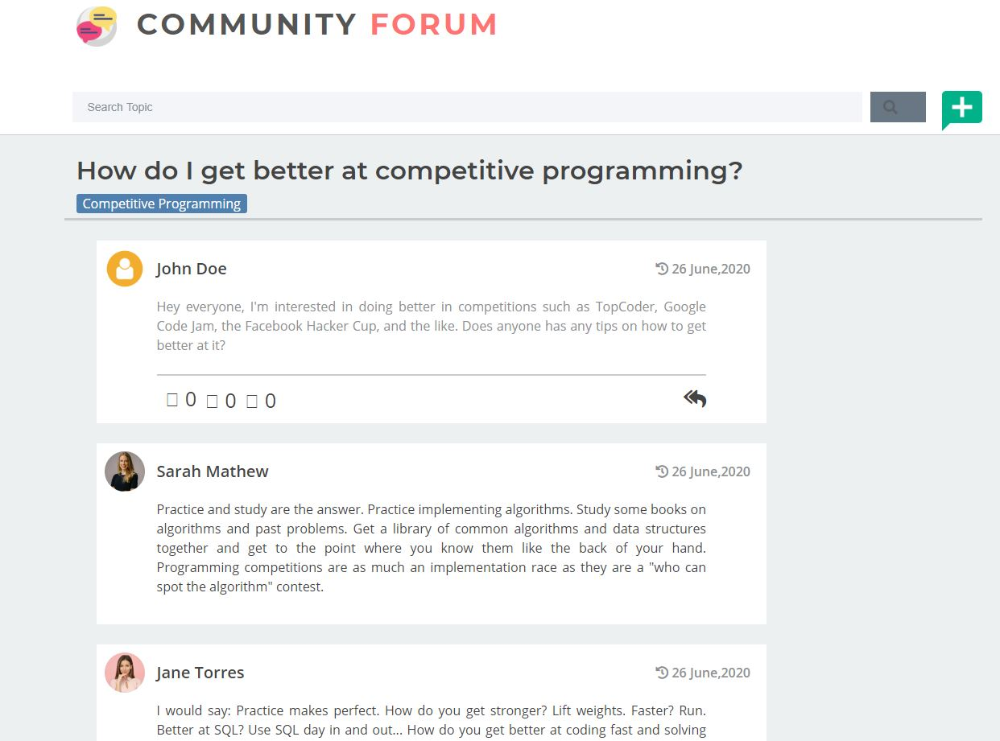

# Job Application and Management Portal
A job application and management portal which uses machine learning model to recommend jobs to users. 
You can view the project here : http://18.144.84.225/

#### Job Recommendations:
 Designed an item based and user based collaborative filtering which recommends jobs to users based on jobs they have applied to and based on similiar
user profiles. 
- The **item based collaborative filtering**, uses locality sensitive hashing with cosine similiarity to find out the most similiar jobs. 
- The **user based collaborative filtering**, uses nearest neighbor algorithm to find out the users most similar to the current user.

#### Technology Stack:
- HTML
- React.js
- Node.js
- Express.js
- Redux
- CSS
- Python Flask (for deploying the machine learning model)
- AWS (EC2, RDS, S3) - for cloud deployment

## Architecture:

## Snapshots:

Some snapshots from th application:

#### Homepage:

#### Profile

#### Job Portal:

#### Add Job:

#### Discussion Forum

